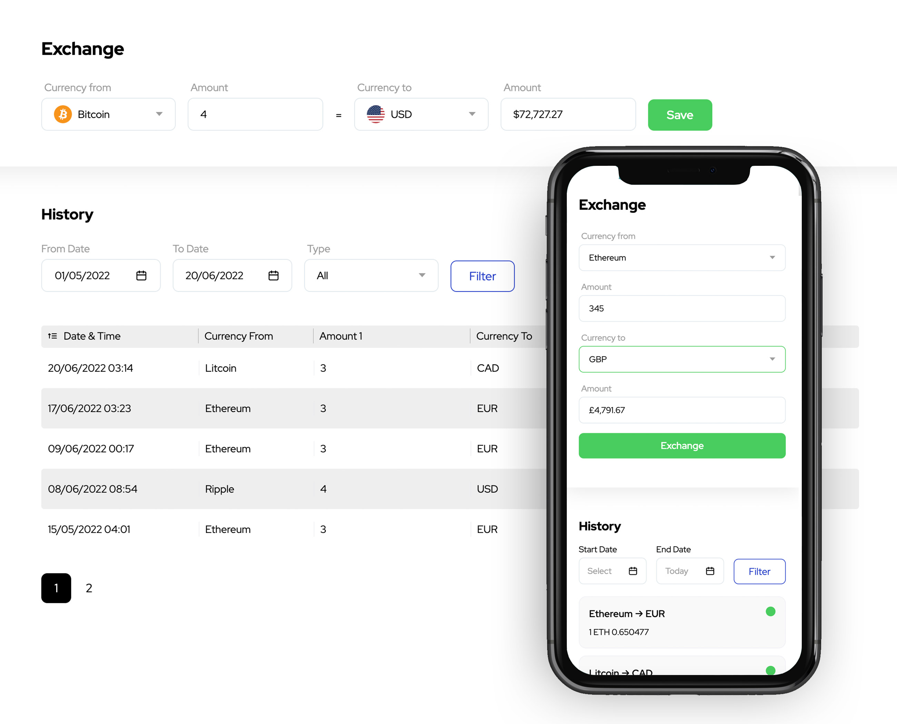

# Exchange Widget
This widget simulates a application to exchange crypto for several currencies. The application consists of a React front-end client.

## Layout

## Tecnologies

## Live Project
https://exchange-widget.vercel.app

## How to use
**Install NodeJs packages**

    $ yarn

**Run project on local**

    $ yarn run dev

**Run tests**

    $ yarn run test

**Build project**

    $ yarn build

## Referencies
**Custom date picker example**
https://betterprogramming.pub/create-a-custom-date-picker-with-react-and-typescript-from-scratch-25d44dc0b76d

**Accessible UI components**
https://headlessui.dev

**Utility-first CSS**
https://tailwindcss.com

**Icons**
https://phosphoricons.com

**Fake data**
https://fakerjs.dev

**Date Handler**
https://day.js.org/en/

**Mock server**
https://miragejs.com

**Cache and update data**
https://react-query.tanstack.com/

**Client HTTP**
https://axios-http.com/ptbr/docs/intro

